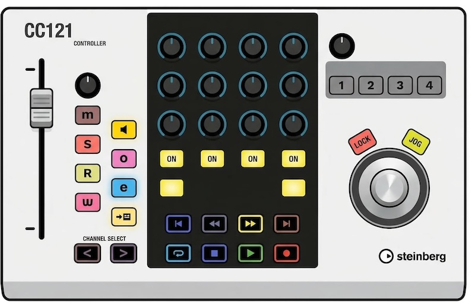

# Steinberg CC121 for Logic Pro

<div style='text-align: center; padding: 1rem; padding-left: 2rem; padding-right: 2rem'>



</div>

This is an opinionated Logic Pro X MIDI device script for the Steinberg CC121 MIDI controller. 

As the device is relatively expensive, I didn’t want to invest in a new controller 
and instead chose to adapt it for use with Logic Pro – and this is the result.

## Control Mapping Overview
As the controller was originally designed for Cubase, not all mappings
translate logically to Logic Pro.
Any deviations from the original Cubase mappings are highlighted in
yellow.

### Mapping table

**Channel Strip** — operates on the selected track:

| Control          | Function                                                               |
|------------------|------------------------------------------------------------------------|
| Fader            | Volume                                                                 |
| Pan knob         | Pan                                                                    |
| Mute             | Toggle mute                                                            |
| Solo             | Toggle solo                                                            |
| Automation Read  | Read automation                                                        |
| Automation Write | Touch automation                                                       |
| Monitor          | Input monitoring                                                       |
| Record Arm       | Arm for recording<br/>links when recording is active                   |
| e-Button         | Press once to go to show automation,<br/> once again to show flex mode |
| Edit Instrument  | Open/Close plugin windows                                              |
| Channel ◀ / ▶    | Select previous/next track                                             |

**EQ Section** — Control Channel EQ:

| Knob row         | Parameter                                  |
|------------------|--------------------------------------------|
| Top row          | Q (bandwidth)                              |
| Middle row       | Frequency                                  |
| Bottom row       | Gain                                       |
| Band buttons     | Band enable/bypass                         |
| EQ Type          | Off = bands 1,3,5,6<br/>On = bands 2,4,6,8 |
| All Bypass       | Bypass Channel EQ                          |


**Transport:**

| Button            | Function                   |
|-------------------|----------------------------|
| Cycle             | Loop on/off                |
| Stop              | Stop                       |
| Play              | Play / Pause               |
| Record            | Record                     |
| Rewind / Forward  | Scrub backward/forward     |
| ◀ / ▶             | Go to previous/next marker |

**AI Knob, Jog and Lock buttons:**

| Control          | Function                           |
|------------------|------------------------------------|
| AI Knob          | Horizontal zoom (default)          |
| Lock             | Switches AI knob to vertical zoom  |
| Jog              | Switches AI knob to jog encoder    |

**Function encoder and buttons:**

| Control          | Function                  |
|------------------|---------------------------|
| Function Encoder | Smart Control 1 (volume)  |
| Function 1       | Smart control 4           |
| Function 2       | Smart control 5           |
| Function 3       | Smart control 6           |
| Function 4       | Smart control 7           |

## Installation

The easiest way to install this device script is to download the latest release from 
the [releases page](https://github.com/kknight/cc121-for-logic-pro/releases) page and run the installer.

Alternatively you can clone this repository and copy the `CC121.device` directory to the following directory:

````
mkdir -p /Library/Audio/Midi Device Scripts/Yamaha
cp -a CC121.device /Library/Audio/Midi Device Scripts/Yamaha/
````

## Developing

## Acknowledgements

## License

## Disclaimer