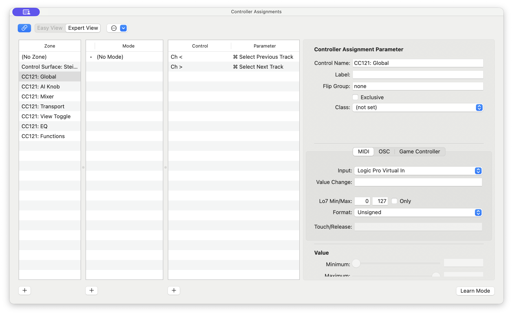

# Developing Guide

There is very little official documentation on how to write Control Surface MIDI scripts for Logic Pro.

This is my attempt to gather information on what I've been able to discover through experimentation, and observation.

## Overview

A Logic Pro controller script is a Lua file that runs inside a sandboxed environment within the DAW.

### Script Locations

Scripts can be placed in one of two locations:

```bash
# User-specific
~/Music/Audio Music Apps/MIDI Device Scripts/
```
or: 
```bash
# System-wide (available to all users)
/Library/Audio/MIDI Device Scripts/
```

**Note!**

If the script is placed in the **user-specific directory**, only the `controller_info()` function will be evaluated.  
Other functions (e.g. `controller_midi_in`, `controller_midi_out`) will **not work**.

### Naming Convention

Logic Pro expects the following naming convention:

```
Manufacturer/DeviceName.device/config.lua
```

If the naming convention is not followed then the script will still be loaded, but automatic mapping of midi inputs and outputs will not work.

### Optional Assets

You can include an optional icon `icon.png` in the same directory as `config.lua`, which should be 256x256 pixels. This icon will be displayed in the Logic Pro control surface UI.

### Debugging
The `config.lua` file is evaluated when Logic Pro initializes and is then **cached**.

To force Logic to reload your script:

- Go to Control Surface settings
- Click **“Delete all assignments”**

Alternately run the following command to enter Lua debug mode, which will then reload the script on every change:

```bash
# Launch Logic Pro with Lua debug output to terminal
cd /Applications/Logic\ Pro.app/Contents/MacOS
LUA_DEBUG=1 ./Logic\ Pro
```

This will also allow you to use the `print()` function to output debug messages to the terminal.

## Minimal Example
The following is a minimal example of a script that will be loaded by Logic Pro:
```lua
function controller_info()
    return {
        name = 'Device Name',
        manufacturer = 'Manufacturer',
        items = {},
        assignments = {},
    }
end;
```
The `controller_info()` is a purely delcarative function and must return a table containing the following keys:
- `name`
- `manufacturer`
- `items`
- `assignments`

The `items` table corresponds to the physical buttons, faders and encoders on the control surface. Each item is a table containing the following keys:
  - `name` – The name of the item.  NB! this is later referenced by the `assignments` table
  - `label` – The label displayed in the Logic Pro UI
  - `controlID` (optional, integer) – The unique identifier of the item. Used in the callback functions to identify the item.
  - `objectType` – The type of the item. E.g., Fader, Button, etc.
  - `midiType` – Interpretation of the MIDI message. E.g., Absolute, Momentary, Keyboard, etc.
  - `valueMode` – How values are interpreted.
  - `midiTouched` – If the knob/button has capacitive touch feedback, then that MIDI message is defined here.
  - `hasFeedback` – Whether Logic sends numeric feedback to this control
  - `hasFeedbackValueText` – Whether Logic sends text feedback to this control
  - `inport` – MIDI input port name
  - `outport` – MIDI output port name
  - `midi` – MIDI message to decode/send.

See the [Logic Lua Reference](https://github.com/kknight/cc121-for-logic-pro/tree/main/docs/LOGIC_LUA_REFERENCE.md)
for available keys and their default values.

**Example:**
```lua
    item = {
        name = "Fader",
        label = "Selected Vol",
        controlID = kControlIDFader,
        objectType = "VFader",
        midiType = "Absolute",
        valueMode = kAssignScaled,
        midiTouched = { 0x90, NOTE.FADER_TOUCH, MIDI_LSB },
        hasFeedback = true,
        hasFeedbackValueText = true,
        inport = PORT_IN,
        outport = PORT_OUT,
        midi = { 0xE0, MIDI_LSB, MIDI_MSB }
    }
```

The `assignments` table correspondes to the Assignments in the Logic Pro UI:

